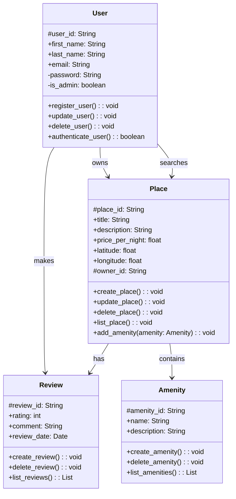

```mermaid
classDiagram
class User {
    #user_id: String
    +first_name: String
    +last_name: String
    +email: String
    -password: String
    -is_admin: boolean
    +register_user(): void
    +update_user(): void
    +delete_user(): void
    +authenticate_user(): boolean
}
class Place {
    #place_id: String
    +title: String
    +description: String
    +price_per_night: float
    +latitude: float
    +longitude: float
    #owner_id: String
    +create_place(): void
    +update_place(): void
    +delete_place(): void
    +list_place(): void
    +add_amenity(amenity: Amenity): void
}
class Review {
    #review_id: String
    +rating: int
    +comment: String
    +review_date: Date
    +create_review(): void
    +delete_review(): void
    +list_reviews(): List<Review>
}
class Amenity {
    #amenity_id: String
    +name: String
    +description: String
    +create_amenity(): void
    +delete_amenity(): void
    +list_amenities(): List<Amenity>
}
User --> Place : owns
User --> Place : searches
User --> Review : makes
Place --> Review : has
Place --> Amenity : contains
```