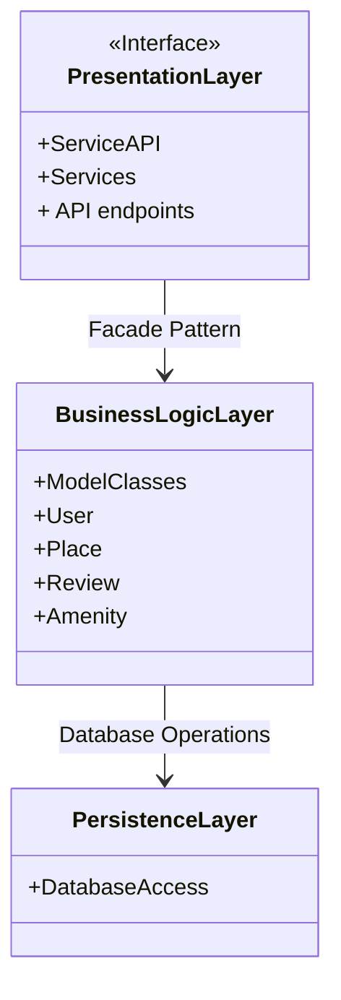
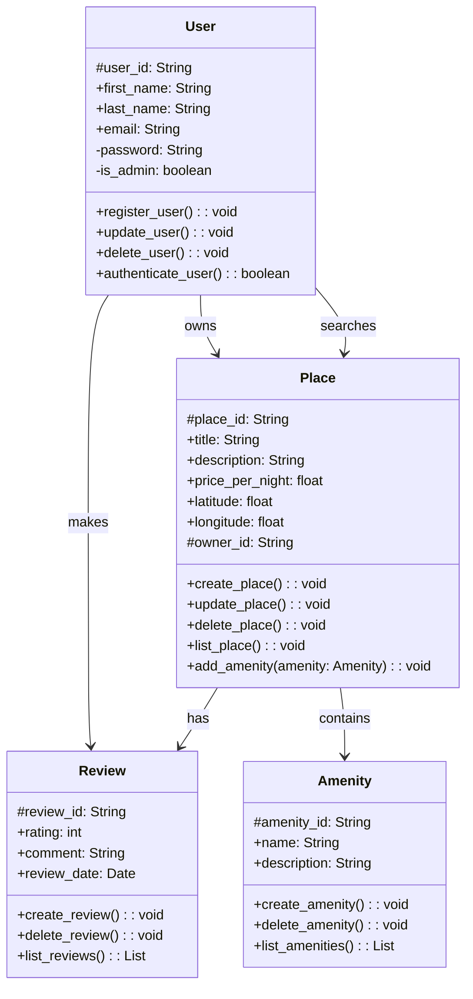
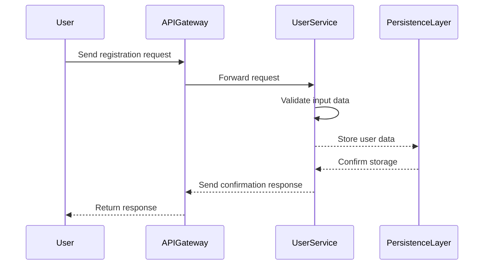

# HBnB Technical Documentation

## Introduction

This document serves as a comprehensive technical guide for the HBnB project, detailing the architecture, design, and interactions between various components. It consolidates the high-level package diagram, detailed class diagram for the Business Logic Layer, and sequence diagrams for API calls. This document aims to provide a clear reference for implementation phases and system architecture, ensuring consistency and clarity throughout the project.

### High-Level Package Diagram



## Explanation

- Presentation Layer: Handles user interactions and exposes APIs to clients.
- Business Logic Layer: Encapsulates the core logic and models, including User, Place, Review, and Amenity.
- Persistence Layer: Manages data storage and retrieval via database operations.
- Facade Pattern: Facilitates communication between layers, providing a unified interface and simplifying interactions.

### ClassDiagram



# Explanation

- User: Represents system users with methods to register, authenticate, and manage accounts.
- Place: Represents places listed by users, allowing creation, update, deletion, and listing of places.
- Review: Captures user feedback for places, including ratings and comments.
- Amenity: Represents additional features linked to places, such as pools or parking.

Relationships:
-User owns Place and submits Review.
-Place is associated with Review and contains Amenity.

### API Interaction Flow
## HbnB - sequenceDiagram

1. User Registration


2. Place Creation
```mermaid
    participant User
    participant APIGateway
    participant PlaceService
    participant PersistenceLayer
    User->>APIGateway: Submit place details
    APIGateway->>PlaceService: Forward request
    PlaceService->>PlaceService: Validate request
    PlaceService-->>PersistenceLayer: Store place data
    PersistenceLayer-->>PlaceService: Confirm storage
    PlaceService-->>APIGateway: Send confirmation
    APIGateway-->>User: Return place ID
```

3. Review Submission
```mermaid
    participant User
    participant APIGateway
    participant ReviewService
    participant PersistenceLayer
    User->>APIGateway: Submit review
    APIGateway->>ReviewService: Forward request
    ReviewService->>ReviewService: Validate review
    ReviewService-->>PersistenceLayer: Store review data
    PersistenceLayer-->>ReviewService: Confirm storage
    ReviewService-->>APIGateway: Send success response
    APIGateway-->>User: Return confirmation
```

4. Fetching a List of Places
```mermaid
    participant User
    participant APIGateway
    participant PlaceService
    participant PersistenceLayer
    User->>APIGateway: Send search request
    APIGateway->>PlaceService: Forward request
    PlaceService->>PersistenceLayer: Query places
    PersistenceLayer-->>PlaceService: Return place data
    PlaceService->>PlaceService: Format response
    PlaceService-->>APIGateway: Send response
    APIGateway-->>User: Return list of places
```

# Explanation

- User Registration: Captures user details, validates them, and stores the information in the database.
- Place Creation: Allows users to create and save a new place listing with relevant details.
- Review Submission: Enables users to add reviews for a place, storing the data for future reference.
- Fetching Places: Queries the database for places based on user-provided criteria and formats the result.

## Conclusion

This document provides a detailed overview of the HBnB system architecture and design. It outlines the high-level package diagram, detailed class diagram for the Business Logic Layer, and sequence diagrams for critical API calls. This blueprint serves as a reference throughout the development phases, ensuring a consistent and efficient implementation process.
