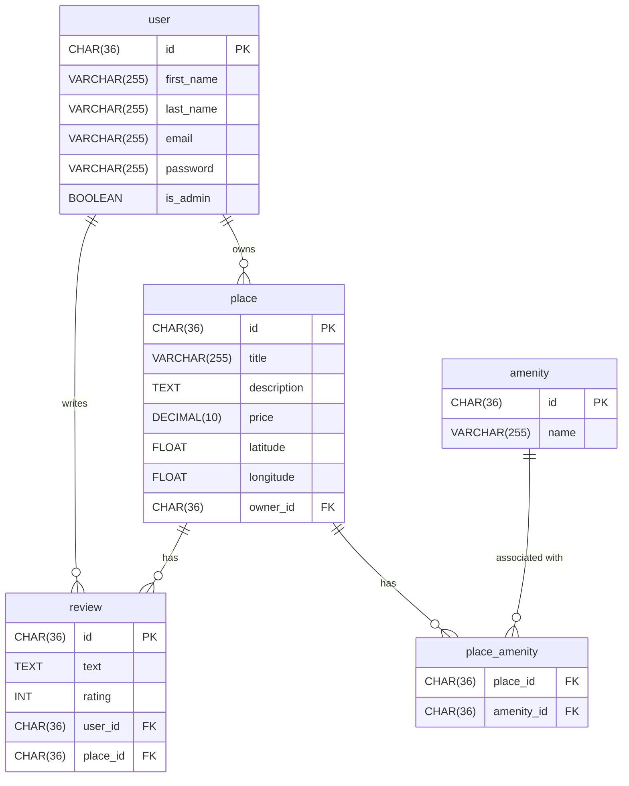

```mermaid
erDiagram
    user {
        CHAR(36) id PK
        VARCHAR(255) first_name
        VARCHAR(255) last_name
        VARCHAR(255) email
        VARCHAR(255) password
        BOOLEAN is_admin
    }

    place {
        CHAR(36) id PK
        VARCHAR(255) title
        TEXT description
        DECIMAL(10) price
        FLOAT latitude
        FLOAT longitude
        CHAR(36) owner_id FK
    }

    review {
        CHAR(36) id PK
        TEXT text
        INT rating
        CHAR(36) user_id FK
        CHAR(36) place_id FK
    }

    amenity {
        CHAR(36) id PK
        VARCHAR(255) name
    }

    place_amenity {
        CHAR(36) place_id FK
        CHAR(36) amenity_id FK
    }

    %% Relationships
    user ||--o{ place : "owns"
    user ||--o{ review : "writes"
    place ||--o{ review : "has"
    place ||--o{ place_amenity : "has"
    amenity ||--o{ place_amenity : "associated with"
```
