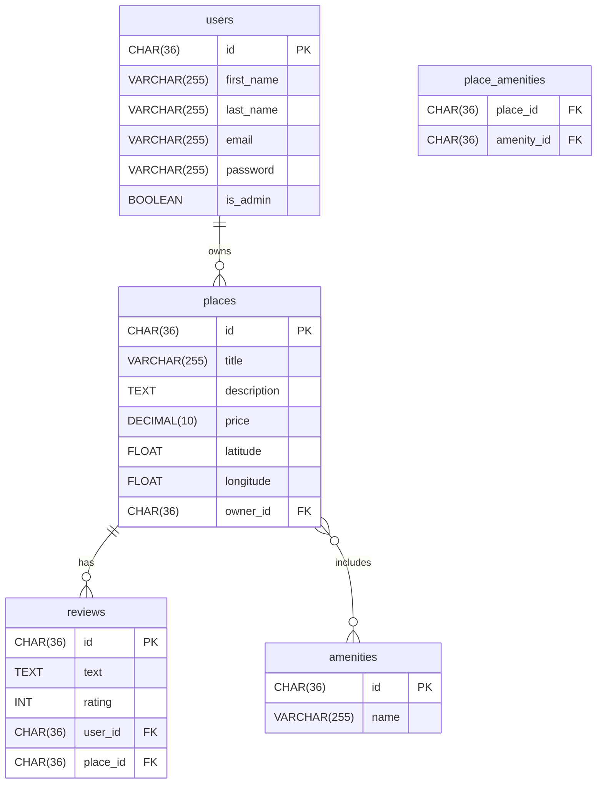

```mermaid
erDiagram
    users {
        CHAR(36) id PK
        VARCHAR(255) first_name
        VARCHAR(255) last_name
        VARCHAR(255) email
        VARCHAR(255) password
        BOOLEAN is_admin
    }

    places {
        CHAR(36) id PK
        VARCHAR(255) title
        TEXT description
        DECIMAL(10) price
        FLOAT latitude
        FLOAT longitude
        CHAR(36) owner_id FK
    }

    reviews {
        CHAR(36) id PK
        TEXT text
        INT rating
        CHAR(36) user_id FK
        CHAR(36) place_id FK
    }

    amenities {
        CHAR(36) id PK
        VARCHAR(255) name
    }

    place_amenities {
        CHAR(36) place_id FK
        CHAR(36) amenity_id FK
    }

    %% Relationships
    users ||--o{ places : "owns"
    places ||--o{ reviews : "has"
    places }o--o{ amenities : "includes"
```
